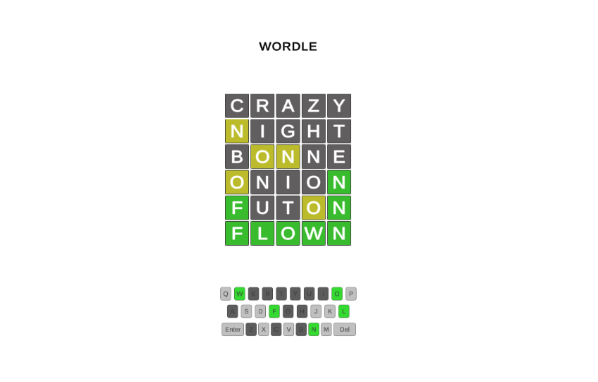

# Worle
This project is a Worle clone written in Unity.

## How to play:
You have 6 attempts to guess the correct word.  
You can use your mouse or keyboard to guess a word. 
Each guess must be a valid 5 letter word. 
After submitting a guess, the letters will turn green, yellow, or gray. 
Green: The letter is correct, and is in the correct position. 
Yellow: The letter is present in the solution, but is in the wrong position. 
Gray: The letter is not present in the solution.

## Gallery

